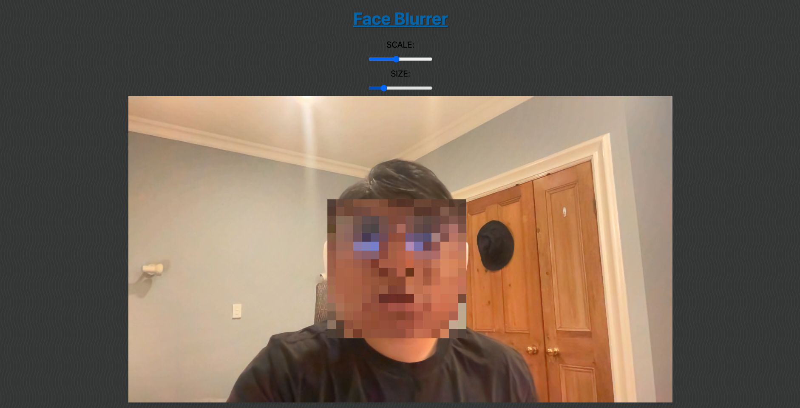
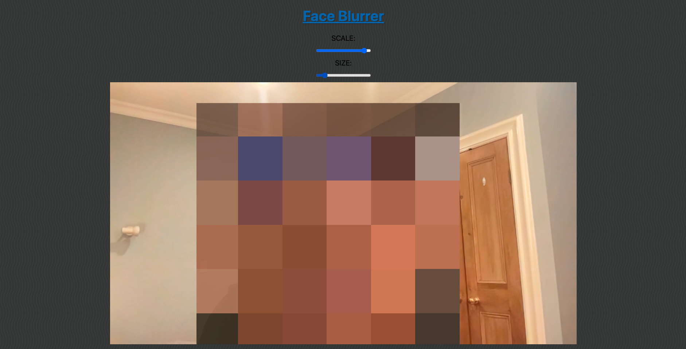

# face-blurrer
Blurs your face on camera - small, fun browser project.

## Steps to get it working

1. Clone Repo/Download files.
2. (Download &)Run npm install on the terminal.
3. Run ```parcel filename.html```
4. Or Open the file on a browser(local).
5. Allow camera access to the browser.
6. The face on camera should be blurred.

## Functionalities

This web project allows you to blur your face. It includes a slider to increase and decrease the scale of the  blur and the size of the blur.
The core application is useful for custom-built applications/websites that might want to add the functionality to blur the users face.

If you maximze the scale and size of the blur, you'll look like a minecraft character lol(see below).

### Normal Size



## Enlarged Size
